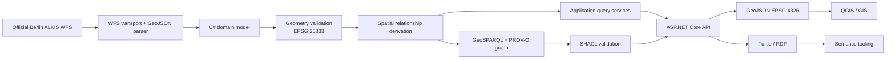

# berlin-semantic-cadastre

A .NET geospatial and semantic integration platform that transforms official Berlin cadastral and building data into a CRS-safe C# domain model, derives spatial relationships, publishes GeoSPARQL-compatible RDF, and exposes GIS-oriented query and export APIs.

> **Status:** v1 release candidate. The repository is only promoted to `1.0.0` after deterministic CI and container validation are green. It is a read-oriented research integration system, not an authoritative cadastral application.

## Overview

Berlin publishes authoritative cadastral and administrative vector data through OGC services. Those datasets are excellent GIS inputs, but cross-domain software still has to solve several distinct problems: feature ingestion, source-schema isolation, CRS correctness, geometry validation, spatial relationship derivation, provenance, semantic representation, and interoperable export.

`berlin-semantic-cadastre` implements that bridge. It keeps official WFS schemas at the infrastructure boundary, normalises geometry into **ETRS89 / UTM zone 33N (EPSG:25833)** for metric calculations, derives parcel/building/district relationships with NetTopologySuite, publishes selected identity and relationship data as RDF using GeoSPARQL and PROV-O, validates graph structure with SHACL, and exports WGS84 GeoJSON for QGIS and other GIS clients.

It deliberately does **not** try to replace QGIS, ALKIS software, or a cadastral editing system.

## Use cases

The API can answer questions such as:

- Which buildings lie on a selected parcel?
- Which parcel contains a point?
- Which parcels or buildings intersect a supplied analysis geometry?
- Which buildings lie within a metric distance of a location?
- Which buildings belong to a district?
- Which parcels contain more than a selected number of buildings?
- What parcel, district, geometry and source-provenance relationships are published for an entity?
- How can the current result set be exported as GeoJSON or GeoSPARQL-compatible Turtle for downstream GIS/semantic workflows?

## Architecture



The solution uses five deliberately small production projects:

| Project | Responsibility |
| --- | --- |
| `BerlinCadastre.Domain` | Cadastral entities, IDs, CRS and geometry invariants |
| `BerlinCadastre.Application` | Repository abstraction, spatial queries and derived relationships |
| `BerlinCadastre.Infrastructure` | Berlin WFS access, source mapping, CRS transformation, ingestion and GeoJSON export |
| `BerlinCadastre.Semantics` | GeoSPARQL/PROV graph construction, SHACL validation and Turtle export |
| `BerlinCadastre.Api` | HTTP contracts, dependency composition, readiness and export endpoints |

See [`docs/architecture.md`](docs/architecture.md) and the ADRs in [`docs/decisions/`](docs/decisions/).

## Data sources

The runtime is configured for official Berlin WFS services:

| Dataset | WFS endpoint | Feature type | Internal CRS | Licence |
| --- | --- | --- | --- | --- |
| ALKIS Berlin Flurstücke | `https://gdi.berlin.de/services/wfs/alkis_flurstuecke` | `alkis_flurstuecke:flurstuecke` | EPSG:25833 | dl-de-zero-2.0 |
| ALKIS Berlin Gebäude | `https://gdi.berlin.de/services/wfs/alkis_gebaeude` | `alkis_gebaeude:gebaeude` | EPSG:25833 | dl-de-zero-2.0 |
| ALKIS Berlin Bezirke | `https://gdi.berlin.de/services/wfs/alkis_bezirke` | `alkis_bezirke:bezirksgrenzen` | EPSG:25833 | dl-de-zero-2.0 |

The source contracts were reviewed on **2026-09-15**; the Berlin Open Data metadata pages reported a dataset state of **2026-07-31** at that review. Source schemas can change, so normal CI uses deterministic fixtures and a separate scheduled/manual workflow checks live compatibility.

See [`docs/data-sources.md`](docs/data-sources.md).

## Semantic model

The custom ontology is intentionally small. It reuses established vocabularies instead of turning ordinary application state into RDF:

```text
cad:CadastralParcel       rdfs:subClassOf geo:Feature
cad:Building              rdfs:subClassOf geo:Feature
cad:AdministrativeDistrict rdfs:subClassOf geo:Feature

Building --cad:locatedOnParcel--> CadastralParcel
Building --cad:locatedIn--------> AdministrativeDistrict
Parcel   --cad:locatedIn--------> AdministrativeDistrict
Feature  --geo:hasGeometry-----> geo:Geometry
Feature  --prov:wasDerivedFrom-> Source
```

Geometry is emitted as a GeoSPARQL `geo:wktLiteral` with an explicit EPSG:25833 CRS URI. SHACL checks publication structure before Turtle export. Metric spatial functions are executed in .NET/NetTopologySuite; the project does not falsely claim that an external SPARQL store provides GeoSPARQL functions.

See [`ontology/cadastre.ttl`](ontology/cadastre.ttl), [`ontology/shapes.ttl`](ontology/shapes.ttl), and [`docs/ontology.md`](docs/ontology.md).

## Spatial queries

All metric calculations operate in EPSG:25833. The API accepts EPSG:25833 directly and accepts EPSG:4326 for point/intersection inputs where it can transform safely into the internal CRS. Raw longitude/latitude is never treated as metres.

Implemented operations include containment, intersection, boundary-inclusive point coverage, distance, district membership and parcel building-count queries. Envelope checks are used only as prefilters; exact topology is evaluated by NetTopologySuite.

See [`docs/geospatial-model.md`](docs/geospatial-model.md).

## API

Primary routes:

| Method | Route | Purpose |
| --- | --- | --- |
| GET | `/health` | Process health |
| GET | `/ready` | Reports whether parcels, buildings and districts are loaded |
| GET | `/parcels`, `/buildings`, `/districts` | Read loaded domain features |
| GET | `/spatial/buildings/in-parcel/{parcelId}` | Buildings covered by a parcel |
| GET | `/spatial/buildings/in-district/{districtId}` | Buildings in a district |
| GET | `/spatial/parcels/containing-point` | Parcel lookup for a coordinate |
| GET | `/spatial/nearby` | Buildings within a metric distance |
| GET | `/spatial/parcels/multi-building` | Parcels with more than N buildings |
| POST | `/spatial/intersections` | Intersect supplied WKT with parcels or buildings |
| GET | `/semantic/entity/{kind}/{id}` | Turtle subgraph for one entity |
| GET | `/semantic/provenance/{kind}/{id}` | Source provenance |
| GET | `/semantic/graph` | Validated complete in-memory graph |
| GET | `/export/geojson?type=...` | WGS84 GeoJSON export |
| GET | `/export/turtle` | SHACL-validated Turtle export |

Example point query in the internal CRS:

```bash
curl "http://localhost:8080/spatial/parcels/containing-point?x=392000&y=5820000&srid=25833"
```

Example intersection request:

```bash
curl -X POST http://localhost:8080/spatial/intersections \
  -H "Content-Type: application/json" \
  -d '{"wkt":"POLYGON((391000 5819000,393000 5819000,393000 5821000,391000 5821000,391000 5819000))","srid":25833,"featureType":"parcels"}'
```

## QGIS workflow

GeoJSON exports are transformed to **EPSG:4326** for broad GIS interoperability while API feature DTOs retain explicit internal `EPSG:25833` WKT. A typical QGIS workflow is:

1. Start the stack and wait for `/ready` to return HTTP 200.
2. Load `http://localhost:8080/export/geojson?type=parcels` as a vector source, or save the response as `.geojson` first.
3. Repeat for `buildings` and `districts` as required.
4. Style and join these layers with other Berlin GIS sources in QGIS.
5. Use `/export/turtle` separately when RDF/semantic relationships are needed.

A detailed, reproducible walkthrough is in [`docs/qgis-integration.md`](docs/qgis-integration.md).

## Running locally

### Docker (recommended)

```bash
cp .env.example .env
docker compose up --build
```

The API is available at `http://localhost:8080`. Docker enables live WFS ingestion at startup. `/health` verifies the process; `/ready` returns 200 only after parcels, buildings and districts have been loaded.

The default bounding box is deliberately limited to a small Berlin analysis window so an in-memory v1 runtime does not pull the entire cadastral dataset accidentally. Override it in `.env` when needed.

### .NET SDK

Requires the .NET 10 SDK:

```bash
dotnet restore BerlinCadastre.slnx
dotnet build BerlinCadastre.slnx
dotnet test BerlinCadastre.slnx
dotnet run --project src/BerlinCadastre.Api/BerlinCadastre.Api.csproj
```

`Cadastre:LoadOnStartup` defaults to `false` outside Docker so development/test startup is deterministic. Set `Cadastre__LoadOnStartup=true` when a local SDK run should fetch the live Berlin sources.

## Testing

The normal solution test suite is deterministic and does not require Berlin services. It covers domain invariants, geometry/CRS contracts, spatial queries and relationships, WFS parsing/pagination through controlled responses, semantic mapping/SHACL, and ASP.NET Core integration/export behaviour.

Live source compatibility is isolated in `tests/BerlinCadastre.LiveTests` and is intentionally excluded from normal CI.

```bash
dotnet test BerlinCadastre.slnx
dotnet test tests/BerlinCadastre.LiveTests/BerlinCadastre.LiveTests.csproj
```

## CI

`.github/workflows/ci.yml` performs restore, format verification, warning-as-error Release build, deterministic tests, Docker Compose validation, and a production image build.

`.github/workflows/live-source-smoke.yml` runs separately on a weekly schedule or manual dispatch and requests one real feature from each configured official Berlin WFS. External WFS availability therefore cannot randomly break every pull request.

## Limitations

This repository is **not** a legally authoritative cadastral system and does not provide ownership, legal boundary certification, editing, or ALKIS-complete object coverage. The v1 runtime is in-memory and intentionally scoped by a configurable bounding box. Some relationships are spatially derived using representative points where stable source identifiers are not used. Source schemas and availability can change. GeoSPARQL-compatible RDF is produced, but GeoSPARQL query functions are not claimed for an external triple store. Public deployment would require authentication/authorization, TLS, rate limiting, network controls and input hardening beyond the local/research defaults.

See [`docs/limitations.md`](docs/limitations.md) for the full boundary of the system.

## Roadmap

Post-v1 extensions are evidence-driven rather than architectural decoration: spatial persistence/PostGIS if measured data volume requires it; a GeoSPARQL-capable graph store if semantic query workloads justify it; streaming ingestion for larger extents; additional verified ALKIS object types; and direct standards-based serving only where it improves real GIS workflows.

## Licence

Project code is licensed under the repository [`LICENSE`](LICENSE). Upstream Berlin data remains subject to its own published licence and source terms; provenance is retained in runtime entities and exports.
