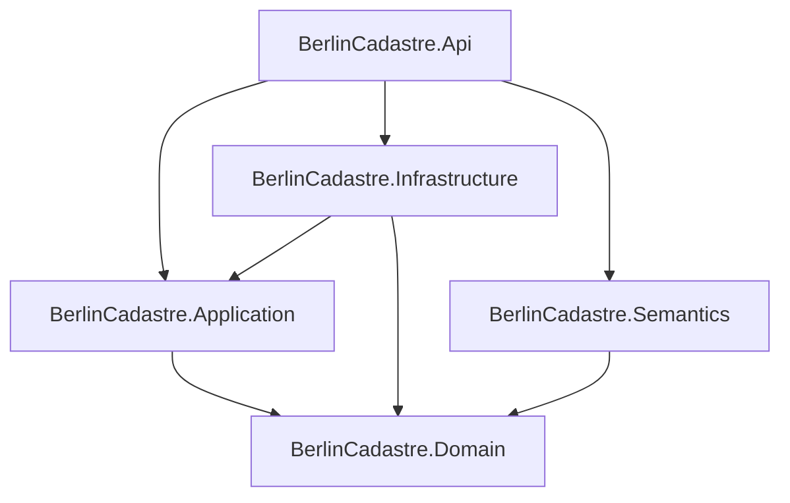

# Architecture

## Purpose

`berlin-semantic-cadastre` is a read-oriented integration platform between authoritative Berlin feature services, spatial application logic, semantic linked-data representation and GIS workflows. The architecture is intentionally modular but not microservice-based: one ASP.NET Core process composes small libraries with explicit dependency direction.

## Dependency direction



The domain has no knowledge of WFS, HTTP, JSON, RDF, ASP.NET Core, QGIS or Berlin service schemas. Application code depends only on the domain and a repository abstraction. Infrastructure translates external source contracts into canonical domain entities. Semantics consumes domain entities after relationship derivation. The API is the composition root.

## Runtime flow

```text
Berlin WFS 2.0
  -> HttpClient transport
  -> GeoJSON source parser
  -> WfsFeature boundary type
  -> Berlin source mapper
  -> canonical domain entities (EPSG:25833)
  -> relationship derivation
  -> in-memory repository
       -> spatial query service -> REST DTOs
       -> GeoJSON export -> EPSG:4326 -> QGIS/GIS
       -> RDF graph builder -> SHACL -> Turtle
```

### Source boundary

`BerlinWfsClient` only knows how to request feature pages and handle transport concerns. `WfsGeoJsonParser` parses the returned FeatureCollection, records source properties, and rejects missing identifiers/geometry or invalid geometry. `BerlinFeatureMapper` maps accepted boundary objects into domain entities and attaches provenance.

Source attributes are preserved as an attribute dictionary instead of becoming WFS-shaped domain classes. This is deliberate: Berlin can evolve source fields without forcing domain consumers to depend on every provider-specific attribute.

### Domain and application boundary

Every `GeometryReference` carries a `CoordinateReferenceSystem` and enforces that the NetTopologySuite SRID agrees with it. Empty or topologically invalid geometry is not accepted into the domain.

`SpatialQueryService` performs exact geometry predicates after envelope prefilters. `SpatialRelationshipDeriver` assigns parcel/district relationships from spatial evidence. The repository is an application abstraction and its current implementation is in memory.

### Semantic boundary

`RdfGraphBuilder` publishes only concepts that benefit from linked-data interoperability: feature identity, GeoSPARQL geometry, parcel/building/district relationships and source provenance. It does not duplicate arbitrary runtime DTOs into RDF.

`ShaclValidationService` validates graph structure before publication. SHACL is used to prove structural conformance, not source truth or cadastral correctness.

### API boundary

ASP.NET Core uses explicit DTOs and never returns infrastructure types. Spatial inputs are restricted to known CRS values. GeoJSON export always transforms internal geometry to WGS84. Turtle output is validated before it is returned.

## Storage decision

The v1 default is in-memory storage because the default runtime intentionally targets a bounded analysis window and the required query semantics fit NetTopologySuite. PostGIS is not introduced merely for appearance. If measured feature counts, parse time, memory usage or query latency exceed the in-memory design envelope, spatial persistence is the next architectural step.

## Readiness and failure behaviour

`/health` means the process is alive. `/ready` is stricter: parcels, buildings and districts must all be loaded. Live WFS ingestion can fail without crashing the API process; the failure is logged and readiness remains degraded. Invalid individual source features are rejected explicitly and included in ingestion summary counts rather than silently discarded.

## Configuration

Configuration follows normal .NET conventions and can be overridden with environment variables such as:

```text
Cadastre__LoadOnStartup
Cadastre__InitialBoundingBox
Cadastre__ParcelEndpoint
Cadastre__BuildingEndpoint
Cadastre__DistrictEndpoint
Cadastre__ParcelFeatureType
Cadastre__BuildingFeatureType
Cadastre__DistrictFeatureType
Cadastre__PageSize
Cadastre__MaxPages
Cadastre__RetryCount
Semantic__ShapesPath
```

Public WFS endpoints are configuration, not secrets. No secrets are required by the v1 local runtime.
